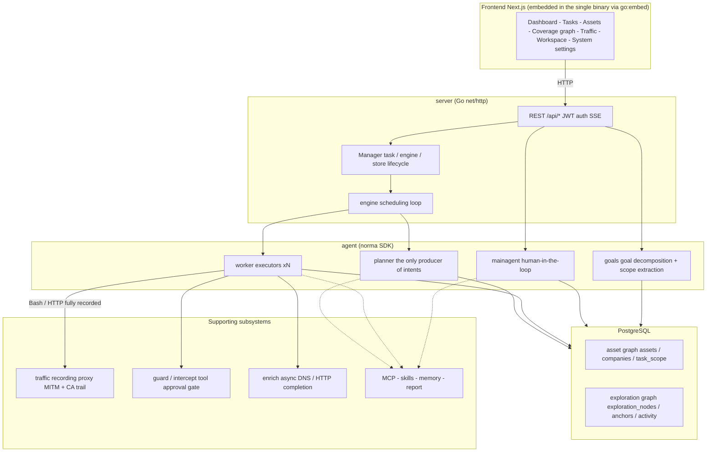
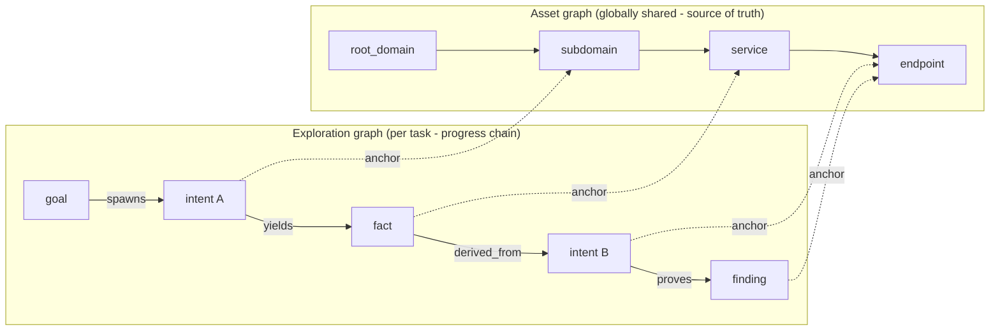
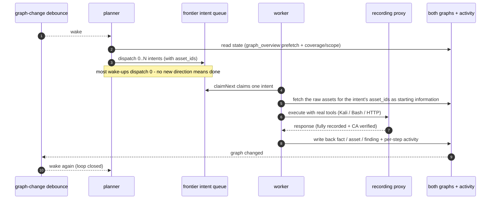
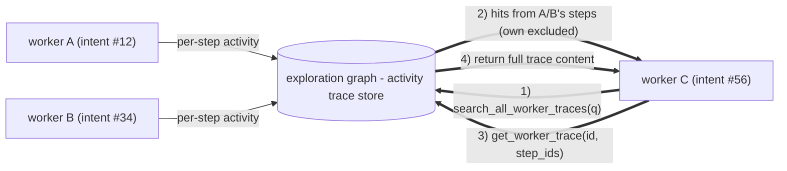
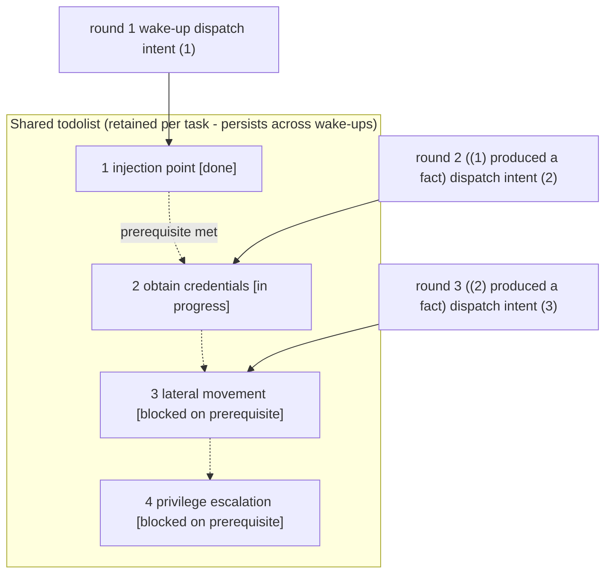

<div align="center">

# IMTREX

AI-driven autonomous penetration testing system (Go backend + Next.js frontend)


🌐 **Live demo**: [https://artex-demo.vercel.app/](https://artex-demo.vercel.app/)

</div>

---

## About this fork

IMTREX is based on [Autumn-27/ARTEX](https://github.com/Autumn-27/ARTEX). This branch ports English
translations from [KbaHaxor/ARTEX-EN](https://github.com/KbaHaxor/ARTEX-EN) onto the newer 0.3.15
code. The English-language port is under review: some recently added comments, historical change
logs, and compatibility-sensitive strings may remain untranslated. Licensing, copyright, and
the original author's terms are inherited from upstream (see [License and disclaimer](#license-and-disclaimer)).

> ⚠️ **The published Docker image is the upstream Chinese build.** `autumn27/artex` is built by
> upstream's CI and has nothing to do with this translation, so `docker compose up -d` and the
> prebuilt [Releases](https://github.com/Autumn-27/ARTEX/releases) archives will all give you the
> **Chinese** interface. To run the English build you must **build from source**:
> [Build on Windows](#option-4-build-on-windows) · [build a single binary](#option-5-build-a-single-binary-from-source-linux--macos) ·
> [build your own Docker image](#option-6-build-your-own-docker-image-english) (**[full guide: DOCKER.md](DOCKER.md)**).

A few Chinese strings are kept deliberately, each with a comment explaining why — ICP filing numbers
and their detection, the legacy `[模型]` reason prefix (matched alongside the new `[model]` so rows
written by an older database still classify correctly), the quota-exhausted markers Chinese LLM
gateways return, the full-width comma in `split()` character classes, and the test fixtures whose
whole purpose is to prove non-ASCII/GBK handling.

---

## Screenshots

> For the full interactive experience, see the [live demo](https://artex-demo.vercel.app/).

| Dashboard (overview / token usage / activity stream) | Task list |
| :---: | :---: |
|  |  |

| Task - execution trace (sessions / tool calls) | Exploration chain |
| :---: | :---: |
|  |  |

| Findings | Assets |
| :---: | :---: |
|  |  |

| Asset coverage graph (force-directed layout - tested nodes highlighted - collapsible nodes) |
| :---: |
|  |

| Traffic recording | Human-in-the-loop chat |
| :---: | :---: |
|  |  |

| Agent management | LLM configuration |
| :---: | :---: |
|  |  |

| Interception approvals | Backend logs |
| :---: | :---: |
|  |  |


---

## Approval record details

The global "Approval records" page, the per-task "Interception approvals" view and the approval cards in chat can all be expanded to show full details. The presentation follows
[AegisHook's approval detail component](https://github.com/RuoJi6/AegisHook/blob/main/web/src/components/CallDetail.vue), rendered with ARTEX's own components and theme:


## Asset sync (ScopeSentry)

Asset data can be synced straight from [ScopeSentry](https://github.com/Autumn-27/ScopeSentry), so you do not have to collect it twice:

- On the "**Asset sync**" page, enter the ScopeSentry address and API key to connect the data source;
- Pick the targets and asset types to sync, scoped by **project** or by **task** (domain / subdomain / IP / port / site / endpoint...);
- Import in one click. Assets are merged under the company asset scope and land directly in ARTEX's asset graph for agents to explore.

---

## Installation

> Requires a **PostgreSQL** database; exploration requires an **LLM** (`ANTHROPIC_API_KEY` or `OPENAI_API_KEY`, which can also be configured in the UI).

> ⚠️ **Options 1-3 install the upstream Chinese build.** They pull the `autumn27/artex` image or a
> Releases archive, neither of which contains this translation. For the English build use
> **[Option 4 (Windows)](#option-4-build-on-windows)**, **[Option 5 (Linux/macOS)](#option-5-build-a-single-binary-from-source-linux--macos)**
> or **[Option 6 (your own Docker image)](#option-6-build-your-own-docker-image-english)**.

### Option 1: one-click install script (recommended)

```bash
git clone https://github.com/RabbITCybErSeC/IMTREX.git
cd IMTREX
./install.sh
```

The script detects / installs Docker, then lets you choose **(1) everything in Docker** or **(2) build and run locally**:

- **(1) All Docker**: enter a Postgres password (press Enter for a random one) -> `.env` is written automatically -> `docker compose up -d`.
- **(2) Local**: choose a database (connect to an existing one / start one with Docker) -> generate `config.json` -> `go` builds a single binary with the frontend embedded -> start.

Once installed, open **http://localhost:8787** (the first visit goes to `/setup` to set the admin password).

### Option 2: Docker Compose (manual)

```bash
git clone https://github.com/RabbITCybErSeC/IMTREX.git
cd IMTREX
cp .env.example .env          # set POSTGRES_PASSWORD, optionally ANTHROPIC_API_KEY
docker compose up -d          # pulls the autumn27/artex image + postgres
# -> http://localhost:8787
```

The image ships with the usual tooling (ripgrep/curl/vim/npm/nmap...); `./skills` and `./data` are persisted as bind mounts.

For remote MCP you can pick `http` (Streamable HTTP) or `sse` (legacy SSE) in the system settings. Legacy SSE services usually open the event stream with `GET /sse` and then receive JSON-RPC requests on the `/message?sessionId=...` endpoint returned by the service; set the URL to `/sse` and add the header `Authorization=Bearer <token>`.

### Option 3: download a prebuilt binary (Releases)

Download the zip for your platform from [Releases](https://github.com/Autumn-27/ARTEX/releases). Unpacking it gives you `artex` + `start.sh` (`start.bat` on Windows) + `skills/` + `config.example.json`:

```bash
cp config.example.json config.json   # fill in the database connection
./start.sh                           # -> http://localhost:8787
```

> Start with `start.sh` / `start.bat` rather than running `./artex` directly. It is a supervisor script: when the program exits, the exit code decides whether it is restarted, and **the [one-click update](#option-1-one-click-update-from-the-ui-recommended) in the UI relies on it to swap the binary**. If you run `./artex` directly, nothing restarts it after an update.
> To keep it running in the background: `nohup ./start.sh >artex.log 2>&1 &`.

### Option 4: build on Windows

Produces a native `artex.exe` with the English frontend embedded. Requires **Go >= 1.26.3**,
**Node >= 20**, **PostgreSQL** and **Git Bash** (shipped with Git for Windows).

**In Git Bash:**

```bash
# 1) static export of the frontend  (~3-4 min)
cd web && npm ci && npm run build:static && cd ..
# 2) copy it into the embed directory
mkdir -p server/webui && rm -rf server/webui/dist
cp -r web/out server/webui/dist
# 3) build  (~1 min, ~50 MB)
CGO_ENABLED=0 go build -tags embedui -o artex.exe ./cmd/artex
```

**In PowerShell**, `npm run build:static` fails: the script is `NEXT_EXPORT=1 next build`, which is
Unix env-var syntax. Set the variable separately instead:

```powershell
cd web
npm ci
$env:NEXT_EXPORT="1"; npx next build
cd ..

New-Item -ItemType Directory -Force server\webui | Out-Null
Remove-Item -Recurse -Force server\webui\dist -ErrorAction SilentlyContinue
Copy-Item -Recurse web\out server\webui\dist

$env:CGO_ENABLED="0"
go build -tags embedui -o artex.exe .\cmd\artex
```

Then start a database, point `config.json` at it and run `start.bat`:

```bash
docker run -d --name artex-pg -p 5433:5432 \
  -e POSTGRES_USER=artex -e POSTGRES_PASSWORD=yourpass -e POSTGRES_DB=artex \
  -v artex-pgdata:/var/lib/postgresql/data postgres:16-alpine

cp config.example.json config.json   # fill in the password
```

```cmd
start.bat
```

-> **http://localhost:8787** (the first visit goes to `/setup` to set the admin password).

> `config.example.json` defaults to port **5433**, which is why the `docker run` above maps 5433. Change
> one or the other if your database listens on 5432. `ARTEX_PG_DSN` overrides the file entirely.
>
> Run `start.bat`, not `artex.exe` directly: it is the supervisor the one-click update relies on to
> restart the process and swap the binary. Extra flags pass straight through, e.g. `start.bat -addr :9000`.
>
> A native Windows build has **no bundled recon toolchain** (no nmap, no Playwright/chromium, no
> dnsutils) — the agent only gets whatever is already on your `PATH`. For the full toolchain, use
> Option 6 instead.

### Option 5: build a single binary from source (Linux / macOS)

```bash
# 1) static export of the frontend
cd web && npm ci && npm run build:static && cd ..
# 2) copy it into the embed directory
cp -r web/out server/webui/dist
# 3) build (the frontend is only embedded with -tags embedui)
CGO_ENABLED=0 go build -tags embedui -o artex ./cmd/artex
./start.sh
```

> `server/webui/dist` must exist **before** the Go build: `//go:embed all:webui/dist` fails at compile
> time when it is missing. Without `-tags embedui` the binary builds fine but serves
> *"the frontend is not embedded in this binary"* instead of the UI.

### Option 6: build your own Docker image (English)

**Recommended for this fork.** Unlike a native binary it keeps the image's recon toolchain (nmap,
Playwright + chromium, dnsutils, whois, ...), which is what the agents reach for through `Bash`.

The Dockerfile compiles nothing — it copies in a **Linux** binary you build first, so cross-compile
it before `docker build` (this works from Git Bash on Windows too):

```bash
cd web && npm ci && npm run build:static && cd ..
rm -rf server/webui/dist && cp -r web/out server/webui/dist
CGO_ENABLED=0 GOOS=linux GOARCH=amd64 go build -tags embedui -o dist/amd64/artex ./cmd/artex
docker build -t artex-en:latest .
```

Then point compose at your image and bring it up:

```bash
cp docker-compose.override.yml.example docker-compose.override.yml
cp .env.example .env              # set POSTGRES_PASSWORD
docker compose up -d
```

> 📖 **[DOCKER.md](DOCKER.md)** covers this in full: how the build fits together, arm64 and multi-arch
> with buildx, upgrading, what ships in the image, and the common errors
> (`exec format error`, `pattern all:webui/dist: no matching files found`, a still-Chinese UI).

### Option 7: build cross-platform release archives

`build.sh` builds and embeds the frontend, strips debug information via the Go linker, and zips the release files. In release mode it produces zips for Linux amd64/arm64, macOS amd64/arm64 and Windows amd64 by default:

```bash
./build.sh --release
# artifacts: dist/artex-0.3.3-*.zip
```

UPX self-extracting binaries can be incompatible with some Linux kernels, virtualized environments or security policies, so UPX is off by default. Use `ARTEX_TARGETS` to customize the targets; once you have confirmed the target environment is compatible, pass `--upx` explicitly to shrink the binary further:

```bash
ARTEX_TARGETS=linux/amd64,windows/amd64 ./build.sh --release
./build.sh --target linux/amd64 --upx
```

---

## Upgrading

> An upgrade replaces the program only and leaves data alone: the Postgres volume `pgdata`, `./data` (jwt.key / SQLite etc.) and `./skills` are all preserved. **Database migrations need no manual step** - every time `artex` starts it idempotently re-runs `schema.sql` (which uses `ADD COLUMN` / `CREATE INDEX IF NOT EXISTS`), i.e. "restart is migrate". Backing up `./data` and the database before upgrading is still recommended.

### Option 1: one-click update from the UI (recommended)

On the **System settings** page (sidebar "System settings" -> `/system/settings`), the **Version and updates** card lets you check for and install new versions without logging into the server.

After you click "Update": the release package for the current platform is downloaded -> checked against the release's `SHA256SUMS` -> the new binary is smoke-tested with `-h` -> staged as `artex.new` -> the program exits and `start.sh` / `start.bat` restarts it, completing the swap. The page waits for the new version to come up and then refreshes.

- **A failure never leaves a broken program behind**: if verification or the smoke test fails, the staged file is discarded and the current version keeps running; if the newly swapped-in version fails to start 3 times in a row, it automatically rolls back to `artex.old` (the failing binary is kept as `artex.failed` for diagnosis).
- **You can roll back at any time**: the previous version is kept as `artex.old`, and the card has a "Roll back to the previous version" action. Note that the database schema is not rolled back.
- **Updating interrupts running tasks** - an update is a restart, so do it when the system is idle.
- **Development builds cannot be updated**: updating is disabled when the version is `dev` or when `git describe` carries a suffix, so that a release build never overwrites a locally built debug binary.
- **Under Docker only the program is replaced, not the image**: toolchains baked into the image (playwright, nmap, ...) are not upgraded along with it, and recreating the container with `docker compose up -d` reverts to the version shipped in the image. To upgrade the image as well, still use `docker compose pull artex && docker compose up -d artex`.
- If reaching GitHub requires a proxy, configure the **global proxy** on the same page and the update path will use it. Updates are downloaded only from GitHub domains and always over HTTPS.

### Option 2: one-click update script

```bash
cd IMTREX
./update.sh
```

The script optionally runs `git pull` first, then lets you choose **(1) Docker update** or **(2) local rebuild** (mirroring `install.sh`):

- **(1) Docker**: optionally specify the target image tag (press Enter to keep `ARTEX_TAG` from `.env`, defaulting to `latest`) -> `docker compose pull` -> `docker compose up -d` (restarting on the new image migrates automatically).
- **(2) Local**: rebuild the static frontend assets -> rebuild `./artex` (restart the process afterwards for it to take effect).

### Option 3: Docker Compose (manual)

```bash
cd IMTREX
git pull                       # update compose / scripts (optional)
# To pin a version: set ARTEX_TAG=v0.2.0 in .env; otherwise latest is used
docker compose pull artex
docker compose up -d artex     # restart on the new image -> schema migrates automatically
docker image prune -f          # clean up old images (optional)
```

### Option 4: prebuilt binary (Releases)

Download the new zip from [Releases](https://github.com/Autumn-27/ARTEX/releases), stop the old process, overwrite `artex` and `skills/` (keeping your `config.json` and `data/`), then restart:

```bash
cp -r <unpacked dir>/skills ./ && cp <unpacked dir>/artex ./
./start.sh
```

### Option 5: build from source

```bash
git pull
cd web && npm ci && npm run build:static && cd ..
cp -r web/out server/webui/dist
CGO_ENABLED=0 go build -tags embedui -o artex ./cmd/artex
# restart ./start.sh
```

On Windows, rebuild `artex.exe` the same way and restart `start.bat`:

```bash
git pull
cd web && npm ci && npm run build:static && cd ..
rm -rf server/webui/dist && cp -r web/out server/webui/dist
CGO_ENABLED=0 go build -tags embedui -o artex.exe ./cmd/artex
```

> Rebuilding from source is the **only** upgrade path for this translation. The one-click update in
> the UI, `update.sh` and `docker compose pull` all fetch upstream's artifacts, which are the Chinese
> build — using them would silently replace your English binary.

---

## Configuration

**Database** (`config.json`, or override it with the `ARTEX_PG_DSN` environment variable):

```json
{
  "database": {
    "host": "127.0.0.1", "port": 5432,
    "user": "artex", "password": "yourpass",
    "dbname": "artex", "sslmode": "disable"
  }
}
```

**LLM**: `export ANTHROPIC_API_KEY=sk-...` (or `OPENAI_API_KEY`); you can also fill it in on the "LLM configuration" page in the UI.
Optional: `ARTEX_LLM_PROVIDER` / `ARTEX_LLM_MODEL` / `ARTEX_LLM_BASE_URL` / `ARTEX_LLM_PROXY`.

**Concurrency**: the number of work agents per task is configured under "System settings" (default 3).

**Common flags**: `./start.sh -addr :8787 -proxy :8788` (`-addr` serves the frontend + API, `-proxy` is the traffic recording proxy). The start script passes flags through to `artex` verbatim.

### Deploying behind a reverse proxy (HTTPS / only 443 exposed)

The frontend and the API/SSE are served by the same backend port (`:8787` by default), and the realtime activity stream uses a **same-origin** address by default, so **you do not need to configure `NEXT_PUBLIC_SSE_BASE`**: expose only 443 publicly and keep 8787 on the internal network.

SSE is a long-lived connection with continuous pushes, so the reverse proxy **must have buffering disabled**; otherwise the browser connects but never receives events (the activity stream just spins). Nginx example:

```nginx
server {
    listen 443 ssl;
    server_name your.domain.com;
    # ssl_certificate / ssl_certificate_key ...

    location / {
        proxy_pass http://127.0.0.1:8787;
        proxy_set_header Host $host;
        proxy_set_header X-Forwarded-Proto $scheme;

        # Critical for SSE: no buffering, long timeout, HTTP/1.1
        proxy_buffering off;
        proxy_cache off;
        proxy_read_timeout 3600s;
        proxy_http_version 1.1;
        proxy_set_header Connection "";
    }
}
```

> Set `NEXT_PUBLIC_SSE_BASE` **at build time** only when SSE must come from a different origin than the page (e.g. a dedicated subdomain). The variable is baked into the static bundle by `next build`, so setting it at container runtime has no effect.

---


## Development

### Manual finding retests

The "Retest" tab on the task detail page lets you page through this task's findings, review previous conclusions and evidence, and kick off a retest by hand. Once started, the current tab stays open and shows a spinner plus "Retesting"; once a fix is confirmed, the finding status is updated to match.

Click "Retest" in the actions column of any row in the findings list, or click "Start retest" in the "Finding retest" section of the finding detail page, and fill in the optional fix version, test conditions or constraints. The system creates a dedicated retest agent session and keeps you on the current page after starting it. The flat list, the per-task grouping and the asset view all offer this entry point; while a retest runs, a spinner and "Retesting" are shown, and you can click through to the corresponding session to follow along. When it finishes the label returns to "Retest". A retest does not require restarting the original scan task. Conclusions are one of "Still reproducible", "Fixed" or "Inconclusive", and each run's conclusion, evidence and session link are stored on the finding detail page.

On first start, a newer backend seeds an editable "Finding retest" (`retester`) agent whose prompt, LLM, run budget and tools can be configured under agent management. It uses the LLM bound to it by default, falling back to the globally active configuration when nothing is bound. When a retest session completes successfully with the conclusion "Fixed", the system automatically moves the finding's disposition to "Fixed"; running, failed, stopped or any other conclusion leaves the status unchanged. The original evidence and report are always preserved. You can also pick "Fixed" manually from the status dropdown. While a retest of the same finding is in flight, the existing session is reused; after it stops, fails or the service restarts, a new one can be started.

In this version the history is viewed through the finding detail page and its sessions; it is not yet included in finding report exports or task archive bundles, and it is not automatically linked to traffic captures. Demo mode only generates clearly labelled simulated records and never contacts a real target.

### Running and testing locally

```bash
./dev.sh    # backend (:8787) + traffic proxy (:8788) + frontend next dev (:5173) -> http://localhost:5173
```

- Backend: `go run ./cmd/artex` (without `-tags embedui` the frontend is not embedded)
- Frontend: `cd web && npm run dev` (`/api` is proxied to the backend, with hot reload)
- Tests: `go test ./...`
- Mock preview (no backend): `cd web && NEXT_PUBLIC_MOCK=1 npm run dev`

---

## System architecture

ARTEX is an **autonomous penetration testing system driven by multiple LLM agents**: a single Go backend binary (with the Next.js frontend embedded) + PostgreSQL, with agent capabilities provided by the [`norma`](https://github.com/Autumn-27/norma) SDK (`agentcore` / `tool` / `permission` / `harness` / `memory` / `transcript`). At its core is a **dual-graph architecture**, plus the two autonomy mechanisms built around it: **process-level information exchange between workers** and a **multi-round shared todolist that keeps the planner's attack chain stable**.

### Layers



| Layer | Responsibility |
| --- | --- |
| **Frontend** | Next.js static export, embedded into the single binary with `go:embed`; visualizes tasks / assets / exploration chains / coverage graphs, plus human-in-the-loop chat |
| **server** | `net/http` routing + JWT auth + SSE; `Manager` owns the lifecycle of tasks, engines and DB stores |
| **engine** | One `plannerLoop` plus N worker goroutines per task; intent claiming, timeout / pause / drain |
| **agent** | goals / planner / worker / mainagent; `ToolSet` exposes both graphs as LLM tools |
| **db** | Postgres persistence for both graphs (pgx); the schema ships via `go:embed` and is created idempotently on every start |
| **Supporting** | Recording MITM proxy, approval gate, async enrichment, MCP / skills / memory / reports |

### Dual-graph architecture: exploration graph + asset graph

The system splits "**what the target is**" and "**how far it has been tested**" into two graphs that are independent of each other but linked through anchors:

- **Asset graph (globally shared)**: the single source of truth for assets, shared across tasks. Nodes are `root_domain / subdomain / ip / service / app / endpoint` and belong to a company; the domain -> subdomain -> service -> endpoint parent/child relationships and the dedupe keys are all computed by the program, with agents submitting only raw information.
- **Exploration graph (one per task)**: the "thinking and progress" trace of a single task. Nodes are `goal / intent / fact / finding / hint`, connected into a **lineage chain** by edges such as `spawns / derived_from / yields / proves`, answering "which facts this direction derived from, and what it produced".
- **The two graphs are linked by anchors**: `exploration_anchors(node_id, asset_id)` anchors intents / facts / findings onto concrete assets. That lets you see which assets an "exploration direction" is hitting, and conversely look up which intents have tested a given asset in this task and which facts they produced. It also powers **asset test coverage** and the **asset coverage graph** (in-scope assets with tested ones highlighted).



> Division of labour: the **planner** reads the state of the exploration graph, judges the goal, and dispatches **intents** into the frontier only when there is a genuinely uncovered direction; a **worker** claims **one intent**, executes it with real tools, writes new assets / facts / findings back into both graphs, and stops. The asset graph holds shared facts; the exploration graph is the per-task progress chain.

### Engine and the intent lifecycle (one full exploration loop)

The engine is an **event-driven** loop: any change to the graph wakes the planner, the planner dispatches intents, a worker claims one, executes it and writes back, and that write-back triggers the next round - until the goal is proved (`prove_goal`).



### Process-level information exchange between workers

In a deep exploration, many valuable observations (an error message, a snippet of a response, a hidden parameter) show up **during one worker's execution** without necessarily being written up as a formal fact. To avoid duplicated effort and let workers along a chain stand on each other's shoulders, workers can **search across other workers' execution traces**:

- `search_all_worker_traces(q)`: keyword search across **the execution traces of other work in this task** (automatically excluding the steps of your own intent); hits carry an `intent_id`;
- `list_worker_traces` / `get_worker_trace(intent_id, step_ids=[...])`: first see which work has run, then pull the full content of specific steps of a particular work to exchange details.

So even when no corresponding fact exists in the exploration graph yet, later workers can reuse observations made during someone else's run - **information flows between workers at the granularity of "execution traces"** while boundaries stay intact (each worker still only works on the single intent it claimed).



### The planner's multi-round shared todolist -> a stable attack chain

A real attack chain is usually a **multi-step sequence with ordering dependencies** (e.g. find an injection point -> obtain credentials -> move laterally -> escalate privileges), and dispatching all of it in parallel at once only causes chaos. The planner therefore keeps a **planning todolist that is retained per task and shared across wake-ups**:

- The planner is event-driven - any graph change wakes it, but **every wake-up is a fresh session**; the shared todolist lets it **record a serial exploitation chain once** and then **dispatch intents step by step across later rounds**, instead of expanding the whole chain up front in a single round;
- Each round only dispatches an intent for the next step whose "prerequisite steps are complete and whose required facts already exist", and updates the list as things progress (marking steps complete once a fact satisfies them).



The attack chain therefore keeps **progressing steadily, without repetition and without getting out of order**, even in an "event-driven, stateless session" environment - which is what lets ARTEX walk a multi-step exploitation chain on its own.

---

## Community

Follow the WeChat official account **SecSentry** by scanning the QR code, then send a direct message to the account to be added to the discussion group.

<div align="center">


</div>

---
## References

https://github.com/oritera/Cairn


## License and disclaimer

### Open source license

This project is licensed under the **GNU Affero General Public License v3.0 (AGPL-3.0)**; the full terms are in the [LICENSE](LICENSE) file at the repository root.

This means anyone is free to use, modify and distribute this project, but **derivative works must also be released under AGPL-3.0**; in particular, **if you modify this project and make it available to users over a network (e.g. by deploying it as an online service), you must also make the complete corresponding source code available to those users**.

> ⚠️ **Important**: an open source license does not itself restrict what the software may be used for. The "Permitted use" and "Disclaimer" sections below are additional terms and a formal statement from the author to users. Please observe them.

**ARTEX is intended solely for personal study, source code research and local technical validation. It must not be used to launch actual tests against any online system or website.**

### Permitted use

- Only for **reading, studying and researching this project's source code**, and for validating technical principles in a **locally isolated environment**;
- Suitable for personal study, academic research, code review and other non-offensive purposes.

### Prohibited use

- **Using this tool to scan, probe, exploit or attack any website, online service or networked system is strictly prohibited** (whether or not you have authorization, and whether or not the assets are your own);
- Using this tool for any real penetration test, red/blue team engagement or production environment is strictly prohibited;
- Using this tool for unauthorized intrusion, data theft, extortion, denial of service or any destructive or criminal activity is strictly prohibited;
- Using this tool for anything that violates the laws and regulations of your country or region is strictly prohibited.

### Compliance responsibility

Users must comply with all laws and regulations on cybersecurity, data protection and computer crime in their own country or region (in mainland China these include, but are not limited to, the Cybersecurity Law, the Data Security Law, the Personal Information Protection Law and the related judicial interpretations). **All legal liability and consequences arising from use of this tool rest solely with the user.**

### Disclaimer

This project is provided "AS IS", without warranty of any kind, express or implied. The author and contributors accept no liability for any direct or indirect loss, data loss, system damage or legal dispute resulting from use of this tool, whether or not it was used appropriately. **By downloading, installing or using this project, you confirm that you have read, understood and agreed to all of the above terms.**
