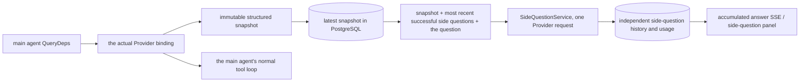

# ARTEX `/btw`

Ordinary chat, a task's MainAgent and the current task's own workers all support independent side questions. Type `/btw <question>` in the main input box to submit one; an empty `/btw` or the "Side question" button opens the history. The desktop uses a resizable side panel, mobile uses a drawer.

A side answer is generated from the snapshot of the agent context at submission time, and supports streaming, follow-up questions, stopping and clearing. Closing the panel, refreshing the page or dropping the SSE connection never cancels the model request. Stopping affects only the current side question; clearing cancels the side question and deletes the side-question history while preserving the main context snapshot.

## Implementation boundaries

It reuses Go, norma v0.3.7, Next.js and the existing Markdown / ResizablePanel / Drawer / AlertDialog components; norma's source was not modified and no dependency was added for side questions. The planner, workers inherited from another task, and tool-style subtask promotion are out of scope here.

- `capture.go` only marks main-loop requests in `Options.Deps.CallModel / CallModelSync`. The Provider decorator sits inside the concrete model, after the routing pool has made its choice, so it records the model actually selected; compaction and summary requests never overwrite the snapshot.
- A snapshot is published at the request start, on a complete model reply, and at a run's terminal state. A half-finished reply still being generated is not published; tool calls stay paired through norma's `MessagesForAPI`, and a tool result enters the snapshot on the next main model request or at the run's terminal state. An aborted stream keeps the previous valid boundary.
- A snapshot preserves the structured messages, system prompt, tool definitions and generation parameters through a JSON deep copy. Model inference holds neither the snapshot lock nor a database transaction.
- `SideQuestionService` calls the concrete Provider; it generates a side-question summary first when necessary, and the final answer is only allowed one reduced retry when the context overflows for the first time and no text or tool call has been emitted yet. It creates no agent session and plugs into no tool executor, main transcript, activity stream or task graph, and it does not go through the task model switching chain. The answer keeps the tool definitions for compatibility with the existing structured tool context; summary requests provide no tools. A newly returned tool call has no execution path.
- One running request per parent session, at most four per service process, with a 120-second timeout per request. Side questions use an independent cancellation context under the service lifetime.
- A side-question request keeps a reference to the model configuration plus a non-sensitive identity summary; credentials are taken from the current configuration at request time. If the configuration is deleted, or an identity field such as the model, protocol or address changes, the main agent must be run first to refresh the snapshot. Tests never change the product's default model.

## Persistence and recovery

`db/schema.sql` creates `side_question_sessions` and `side_question_requests` automatically. The former stores the parent resource, latest snapshot, run number, version and clear version; the latter stores the question, accumulated answer, status, model, snapshot time, usage, event sequence number and pagination ordinal.

The parent session key is the conversation ID, or the task ID + exploration ID + intent ID. Workers do not use the reusable execution slot naming.

Snapshots are coalesced per parent session and flushed every 250 ms, and the database compares `(run_id, version)` to prevent an older version overwriting a newer one. The selected snapshot is saved once more before a side question is submitted. Large in-memory snapshots are released after a successful save; on failure the pending version is kept. Accumulated answer content is written at most every 250 ms as streaming events arrive, and the terminal state is saved immediately with bounded retries on a database error.

On service start, leftover `running` requests are marked `interrupted`, keeping the partial answer and usage already persisted, without replaying the request automatically. The most recently saved context can be used directly for the next question. An old session with no snapshot requires the main agent to be run first; the context is never rebuilt from the UI activity log.

Clearing increments the clear version and deletes the requests; a conditional update stops a late callback writing them back. Physically deleting the parent resource relies on foreign key cascades, a worker's logical deletion removes the side-question data in the same transaction and rejects later snapshots, and task archiving first blocks new requests, waits for the main flow to stop, then cancels and waits for side questions to be persisted. The archive format is v3 and remains compatible with v1/v2, which have no side-question tables.

History is kept in full and returned by an ordinal cursor, at most 20 per page. A model request replays the verbatim text of at most the 20 most recent successful question/answer pairs, with the replayed volume also limited by a token budget; older pairs are kept in a separate rolling summary. When the main context is over budget, only the older part of the side-question copy is summarized, keeping recent structured tool calls and results. Summarization, preparation progress and usage all count towards the side question's concurrency, cancellation and 120-second timeout limits. See [Context budget and open source references](CONTEXT_BUDGET.md) for details.

## HTTP contract

The following paths act as `{parent}` and reuse the existing authentication and resource checks:

- `/api/conversations/{id}`
- `/api/tasks/{id}/chat`
- `/api/tasks/{id}/intents/{iid}`

| Request | Response and behaviour |
| --- | --- |
| `GET {parent}/side-questions?before={ordinal}` | `items` newest first, an independent `current` run status, `snapshot` metadata and `next_cursor`; a cursor of 0 means the latest page / no next page |
| `POST {parent}/side-questions` | JSON `{ "question": "...", "client_request_id": "UUID" }`; a new request returns 202 with the request object, while the same ID and question return the existing object with 200 |
| `DELETE {parent}/side-questions` | Cancels and clears the side questions of the current parent session |
| `GET /api/side-questions/{requestID}/events` | A `snapshot` SSE event whose `id` is an increasing ordinal and whose `data` is the complete accumulated request object; `cleared` is sent when it is cleared |
| `POST /api/side-questions/{requestID}/cancel` | Explicit cancellation; the terminal state can be read from the history or over SSE |

A question is capped at 4000 characters. No snapshot, a changed model configuration, the same parent session being busy, or an idempotency ID conflict return 409; exceeding the global concurrency cap returns 429. Every SSE connection sends the accumulated state first and never relies on text fragments the client received earlier. The frontend merges by request ID + ordinal and discards stale callbacks when switching parent session or clearing.

## Verification and references

Automated checks, real model usage and known limitations are in [VALIDATION.md](VALIDATION.md).

The independent request design follows [Grok CLI's side-question.ts (pinned commit)](https://github.com/superagent-ai/grok-cli/blob/fb97af83f06dca873281d60168430f06c8de6324/src/utils/side-question.ts), and run isolation follows [OpenCode (pinned commit)](https://github.com/anomalyco/opencode/tree/b3f1a96c6dd7adeb28b36dd11add1998fc84d67b). ARTEX's context uses norma's structured messages rather than stitching text together from frontend logs.
