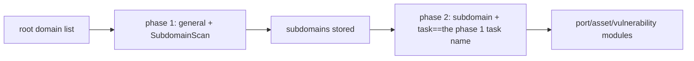

---

## name: scopesentry-mcp
description: Manage a security scanning platform (projects, tasks, templates, assets, nodes) through the ScopeSentry MCP. Use it when the user mentions ScopeSentry, MCP, an API key, a scan task or an asset query.

# ScopeSentry MCP guide

For users who **already have a ScopeSentry instance deployed**. It connects to the platform through Cursor (or another MCP client) and needs no local source code.

## 1. Preparation

### 1.1 Confirm the service is reachable

- Default web interface: `http://<host>`
- MCP endpoint: `http://<host>/mcp` (behind a reverse proxy or frontend proxy, use the actual `/mcp` address)

### 1.2 Create an API key

1. Log in to the ScopeSentry web interface in a browser
2. Go to the **API Key** management page and create a key (or have an administrator create one through their endpoint)
3. Save the returned `ssk_...` string (**shown only once**)

### 1.3 Configure Cursor MCP

Cursor -> Settings -> MCP -> add a server:

```json
{
  "mcpServers": {
    "scopesentry": {
      "url": "http://<your host>:8082/mcp",
      "headers": {
        "X-API-Key": "ssk_your key"
      }
    }
  }
}
```

`Authorization: Bearer ssk_your key` also works.

After configuring it, restart MCP or reload Cursor and confirm that `list_projects`, `list_assets` and so on appear in the tool list.

---

## 2. Tool overview


| Tool                     | Purpose                |
| ---------------------- | ----------------- |
| `list_projects`        | the project tree grouped by tag (including project IDs) |
| `list_projects_data`   | a paginated project list, searchable by name     |
| `get_project`          | project details              |
| `create_project`       | create a project              |
| `list_tasks`           | the scan task list            |
| `get_task`             | task details              |
| `list_scan_templates`  | the scan template list            |
| `get_scan_template`    | template details              |
| `list_plugin_modules`  | the scan pipeline module names          |
| `list_plugins`         | the available plugins (with hash and default parameters) |
| `create_scan_template` | create a scan template            |
| `create_scan_task`     | create a scan task            |
| `list_assets`          | query assets of every kind (a paginated list)       |
| `count_assets`         | count assets (`/api/assets/common/total`) |
| `get_asset_detail`     | asset or vulnerability details           |
| `add_asset_tag`        | add a tag to an asset           |
| `list_nodes`           | the scan node list            |


Each tool's parameters are defined by its MCP tool description (schema); `list_assets` and `count_assets` share the same search and filter syntax, so read `list_assets`'s description before querying assets.

When you need to know "how many in total", use `count_assets` (which maps to the web pagination total endpoint) rather than paging through `list_assets` repeatedly just to count.

---

## 3. Common workflows

### 3.1 Query assets by project

When the user or the context **already specifies a project**, pass `filter.project` to narrow the range, so that too much cross-project data does not slow the response down. Without an explicit project, a project filter is not required.

1. Get the target project's **ObjectID** (`id` / `children[].value`) with `list_projects` or `list_projects_data`
2. Pass `filter.project` to `list_assets` (**it must be the ID, not the project's display name**)

```json
{
  "asset_type": "asset",
  "pageIndex": 1,
  "pageSize": 20,
  "search": "domain=^example.com",
  "filter": {
    "project": ["<project ObjectID>"]
  }
}
```

### 3.2 Create a scan task

1. Get the names of the online nodes with `list_nodes`
2. Get the template **ObjectID** with `list_scan_templates` or `create_scan_template`
3. `create_scan_task`: `name` and `node` are required, and `template` takes the template ID (not the template name)

**The target source `targetSource` (matching the web UI):**

| targetSource | Meaning | Required parameters |
| --- | --- | --- |
| `general` | enter the targets directly | `target` |
| `project` | read the targets from a project | `project` (an array of project ObjectIDs) |
| `asset` | search the web asset database | `search`; optionally `project`, `filter`, `targetNumber` |
| `RootDomain` | search the root domain database | `search`; optionally `project`, `filter`, `targetNumber` |
| `subdomain` | search the subdomain database | `search`; optionally `project`, `filter`, `targetNumber` |
| `UrlScan` | search the URL scan results | `search`; optionally `project`, `filter`, `targetNumber` |
| `*Source` (such as `subdomainSource`) | create from "selected/searched" on an asset page | `search` when `targetTp=search`; `targetIds` when `targetTp=select` |

**Example -- scan a root domain directly:**

```json
{
  "name": "example-subdomain-collection",
  "node": ["node-1"],
  "template": "<template ObjectID>",
  "targetSource": "general",
  "target": "example.com\nfoo.com",
  "project": ["<project ObjectID>"]
}
```

**Example -- continue from the subdomain database (filtering by the previous task name):**

```json
{
  "name": "example-ports-and-vulnerabilities",
  "node": ["node-1"],
  "template": "<ObjectID of the follow-up module template>",
  "targetSource": "subdomain",
  "search": "task==\"example-subdomain-collection\"",
  "project": ["<project ObjectID>"]
}
```

### 3.3 Full information gathering on a root domain (two phases recommended)

When the input is a **root domain** and you want **full information gathering**, scan in two phases rather than running the whole pipeline at once.

**Why:** distributed tasks are dispatched per **individual target**. With a root domain as the target, the node that receives it also runs the follow-up modules for every subdomain it discovers on that same node, which easily causes uneven load, slow runs and errors.

**Best practice:**

1. **Phase one -- subdomain collection only**
   - `targetSource`: `general`
   - `target`: every root domain (one per line)
   - Template: enable only `SubdomainScan` and `SubdomainSecurity` (subdomain scanning + subdomain takeover)
   - Wait for the task to finish with `get_task`

2. **Phase two -- the follow-up modules**
   - `targetSource`: `subdomain`
   - `search`: `task=="<the phase one task name>"` (an exact match on the task name)
   - Optionally narrow it with `project`
   - Template: port scanning, asset mapping, vulnerability scanning and so on (SubdomainScan can be left out)
   - Subdomains are dispatched to the nodes as independent targets, which parallelizes far better

You can achieve the same thing in the web interface by filtering the "subdomain" asset page by task name and using "create a task from subdomains".



### 3.4 Create a scan template

1. `list_plugin_modules` -> the list of module names
2. `list_plugins` (optionally filtered by `module`) -> each plugin's `hash` and default `parameter`
3. `create_scan_template`: use `modules` to specify "module -> array of plugin hashes"

---

## 4. Asset queries (`list_assets` / `count_assets`)

`count_assets` takes the same `asset_type`, `search` and `filter` as `list_assets` and returns `{ "total": N }`, matching the web UI's `/api/assets/common/total`.

```json
{
  "asset_type": "subdomain",
  "search": "task==\"a task name\"",
  "filter": {"project": ["<project ObjectID>"]}
}
```

**Performance advice (for both `list_assets` and `count_assets`):** when a project is specified, narrow the range with `filter.project`; inside `search`, prefer `==` exact matches or `^` prefix matches on indexed fields (see [4.3](#43-search-expressions)) and avoid broad `=` fuzzy queries that slow the response down. Without a project in the context, a project filter is not required.

The types that support `filter.project` are in the table in [4.4](#44-filter-exact-filtering).

### 4.1 Asset types `asset_type`

`asset`, `RootDomain`, `subdomain`, `app`, `mp`, `UrlScan`, `SensitiveResult`, `DirScanResult`, `crawler`, `vulnerability`, `PageMonitoring`, `IPAsset`, `SubdomainTakerResult`

Alias examples: `web`->asset, `vuln`->vulnerability, `ip`->IPAsset, `url`->UrlScan

### 4.2 Parameters


| Parameter                       | Meaning                                      |
| ------------------------ | --------------------------------------- |
| `pageIndex` / `pageSize` | pagination, defaulting to 1 / 20                            |
| `search`                 | the search expression (see the next section)                              |
| `filter`                 | exact filtering as JSON (see the next section)                          |
| `sort`                   | only UrlScan and DirScanResult support sorting by `length` |
| `sid`                    | SensitiveResult only: the sensitive rule name                |


`search` and `filter` **can be used together**.

### 4.3 search expressions

A custom DSL (**not SQL**):


| Operator  | Meaning   | Index | Example                          |
| ---- | ---- | ---- | --------------------------- |
| `=`  | fuzzy match (regex) | no index | `domain=example`            |
| `==` | exact match | **uses the index** | `port==443`                 |
| `!=` | exclude   | - | `port!="80"`                |
| `&&` | and    | - | `domain==example.com && port==443` |
| `||` | or    | - | `title=admin || body=login` |


**Indexes and operators:** fields such as `domain`, `ip`, `port` and `title` are indexed, but only an **`==` exact match** or a **value starting with `^` (a prefix match)** (such as `domain=^example.com`) uses the index; **`=` becomes a regex fuzzy match and cannot use the index**, which gets slow on large data sets.

**search fields common to every type:** `tag`, `task` (the task name), `rootDomain`

**project must not be written inside search** (it is ignored, or errors when combined with `&&`). Filter by project with `filter.project`.

**Common search fields per type:**


| asset_type           | Fields                                                                                  |
| -------------------- | ----------------------------------------------------------------------------------- |
| asset                | domain, ip, port, service, app, title, statuscode, icon, banner, type, body, header |
| RootDomain           | domain, icp, company                                                                |
| subdomain            | domain, ip, type, value                                                             |
| app                  | name, icp, company, category, description, url, apk                                 |
| mp                   | name, icp, company, category, description, url                                      |
| UrlScan              | url, input, source, resultId, type                                                  |
| SensitiveResult      | url, sname, body, info, md5                                                         |
| DirScanResult        | url, statuscode, redirect, length                                                   |
| vulnerability        | url, vulname, matched, request, response, level                                     |
| crawler              | url, method, body, resultId                                                         |
| PageMonitoring       | url, hash, diff, response                                                           |
| IPAsset              | ip, domain, port, service, webServer, app                                           |
| SubdomainTakerResult | domain, value, type, response                                                       |


**search examples:**

- `domain==www.example.com && port==443` (exact, uses the index)
- `domain=^example.com` (prefix match, uses the index)
- `ip==192.168.1.1`
- `task=="a task name"`
- `level==high` (vulnerability)
- `statuscode==200` (DirScanResult)

Use `=` only when you need a fuzzy contains match, such as `title=admin` (which does not use the index and should be combined with a project or similar to narrow the range).

### 4.4 filter exact filtering

A JSON object: several values under the same key are **OR**, and different keys are **AND**.

**Prefer `project` when a project is specified:** when the user or the context names a project and the asset_type supports `project`, include it to narrow the range; when there is no project information, it is not required.


| filter key   | Meaning       | Values                                                     |
| ------------ | -------- | -------------------------------------------------------- |
| `project`    | the owning project     | the **ObjectID**, obtained with `list_projects` / `list_projects_data` |
| `task`       | the source task     | the **task name**, from `list_tasks`'s `name`                         |
| `port`       | the port       | e.g. `"443"`                                                |
| `service`    | the service/protocol    | e.g. `"https"`                                              |
| `app`        | the application fingerprint     | e.g. `"Nginx"`                                              |
| `icon`       | the icon hash  |                                                          |
| `statuscode` | the HTTP status code | mainly used for asset                                               |
| `status`     | the status       | the HTTP code for UrlScan/DirScan; the handling status for vulnerabilities/sensitive results                       |
| `level`      | the vulnerability severity     | critical / high / medium / low / info                    |
| `type`       | the type       | e.g. the subdomain record type A or CNAME                                         |
| `color`      | the sensitive rule colour   | SensitiveResult                                          |
| `sname`      | the sensitive rule name    | SensitiveResult                                          |
| `tags`       | tags       |                                                          |


**Available filter keys per type:**


| asset_type                            | filter key                                                      |
| ------------------------------------- | --------------------------------------------------------------- |
| asset                                 | project, port, service, app, icon, statuscode, type, task, tags |
| RootDomain                            | project, tags                                                   |
| subdomain                             | project, type, task, tags                                       |
| app / mp                              | project, tags                                                   |
| UrlScan                               | status, tags                                                    |
| DirScanResult                         | status, tags                                                    |
| SensitiveResult                       | status, color, sname, tags                                      |
| crawler                               | project, task, tags                                             |
| vulnerability                         | project, level, status, task, tags                              |
| PageMonitoring / SubdomainTakerResult | tags                                                            |
| IPAsset                               | project, port, service, app                                     |


**filter example:**

```json
{"project": ["<project ObjectID>"], "port": ["443"]}
```

**Combined query example:**

```json
{
  "asset_type": "asset",
  "search": "domain=^baidu && port==443",
  "filter": {"project": ["<project ObjectID>"]},
  "pageIndex": 1,
  "pageSize": 10
}
```

**Notes:**

- Prefer `filter.project` when a project is specified (and supported); without a project in the context it is not required
- Do not put the project's display name in `filter.project`
- Use `==` for a known value and `^` for a prefix; avoid abusing `=` fuzzy matching on a large table
- Use `filter.status` for UrlScan's HTTP status; DirScanResult can use `statuscode==200` inside search
- For SensitiveResult by rule name: use `sname=rule name` in `search`, or `filter.sname`

### 4.5 Sorting with sort

Supported only by **UrlScan** and **DirScanResult**:

```json
{"length": "ascending"}
```

Other types ignore `sort` and are sorted by time by default.

---

## 5. Scan template module names

`TargetHandler`, `SubdomainScan`, `SubdomainSecurity`, `PortScanPreparation`, `PortScan`, `PortFingerprint`, `AssetMapping`, `AssetHandle`, `URLScan`, `WebCrawler`, `URLSecurity`, `DirScan`, `VulnerabilityScan`, `PassiveScan`

---

## 6. Troubleshooting


| Symptom        | What to do                                                 |
| --------- | -------------------------------------------------- |
| MCP shows no tools   | check the URL, the API key and whether ScopeSentry is running                    |
| 401 / 403 | recreate or replace the API key                                    |
| assets are not found     | confirm `filter.project` is an ObjectID; do not put project in search |
| creating a template/task fails | `template` must be the template's ObjectID; `node` takes an online node name            |
| queries are very slow or hang   | add `filter.project` when there is a project; switch search to `==` or a `^` prefix on indexed fields and use `=` sparingly; reduce `pageSize` |


---

